# Method Flowchart — Reward-Encoding Neurons across Learning

*Sole method: cross-validated d′(late vs early cue), tracked across training
days by region and cohort. The encoding-model ablation is retired (see
docs/method.md). (Zhong et al. 2025 data.)*

```mermaid
flowchart TB
    Q["`**GOAL**
    Track how the **proportion** and **activation** of
    **reward-encoding neurons** change across **training days**,
    by **brain region** and **cohort** (supervised vs unsupervised).
    Prediction: both rise in **anterior HVAs**, supervised only.`"]

    Q --> D1 & D2

    subgraph INPUTS["SHARED INPUTS"]
        direction TB
        D1["`**Neural data** — up to ~80k neurons,
        SVD(400-PC)-compressed; reconstruct a large
        sample **per region** (V1 · medial · lateral · anterior)`"]
        D2["`**Behavior** — sound-cue position (≈ reward zone,
        present with OR without water), trial structure,
        corridor position, running`"]
    end

    D1 --> B0
    D2 --> B0

    subgraph PRIMARY["PRIMARY — d′(late vs early cue), across days"]
        direction TB
        B0["`**SAMPLE NEURONS** per region per mouse
        (750 per region; capped at what a region has)`"]
        B0 --> B1["`**REWARD-ZONE ACTIVITY**
        per rewarded-corridor (leaf1) trial, mean activity
        in the reward zone (5–40 dm)`"]
        B1 --> B2["`**SPLIT TRIALS** by cue position
        early-cue vs late-cue (cue tracks reward; exists in
        **both cohorts**, so the comparison is fair)`"]
        B2 --> B3["`**CROSS-VALIDATED d′** (per neuron)
        two interleaved trial folds;
        d′ = 2(μ_late − μ_early)/(σ_late + σ_early)`"]
        B3 --> B4["`**CLASSIFY (flag)**
        reward-encoding if |d′| ≥ 0.3 in **both** folds,
        same sign — noise rarely survives both`"]
        B3 --> B5["`**ACTIVATION (strength)**
        mean |d′| over folds, for **all** neurons (unbiased)`"]
    end

    B4 --> AGG
    B5 --> AGG
    AGG["`**AGGREGATE — mouse is the replicate**
    per mouse: **% reward-encoding** (how many) and
    **mean d′** (how strongly); mean ± s.e.m. across mice,
    across **days × region × cohort**`"]

    AGG --> FLOOR
    FLOOR["`**SHUFFLE FLOOR**
    scramble late/early labels, rerun the *same* cross-validated
    test → chance % expected from noise`"]

    FLOOR --> CAV

    CAV["`**INTERPRETATION**
    Above the chance floor, rising before→after learning,
    concentrated in **anterior HVAs**, **supervised only** ⇒
    supports the reward-prediction account. Unsupervised should
    stay near the floor.`"]

    AGG --> CTRL

    subgraph CTRL_BOX["RIGOR / CONTROLS"]
        direction TB
        CTRL["`cross-validation: effect must reproduce in both folds ·
        shuffle null on late/early labels ·
        cue-based reward event (cross-cohort fair) ·
        **mouse** as replicate (neurons are not independent) ·
        skip + report sessions with no cue variation or too few trials`"]
    end

    classDef goal fill:#e9d8fd,stroke:#6b46c1,color:#111
    classDef input fill:#cfe8ff,stroke:#2b6cb0,color:#111
    classDef step fill:#edf2f7,stroke:#718096,color:#111
    classDef stat fill:#d4f4dd,stroke:#2f855a,color:#111
    classDef ctrl fill:#fff3cd,stroke:#b7791f,color:#111
    classDef cav fill:#fde2e4,stroke:#c53030,color:#111
    class Q goal
    class D1,D2 input
    class B0,B1,B2,AGG,FLOOR step
    class B3,B4,B5 stat
    class CTRL ctrl
    class CAV cav
```

