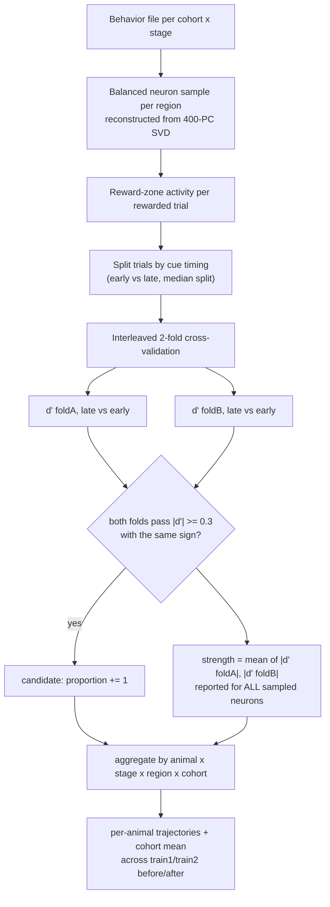

# Method — Reward-Encoding Neurons across Learning

*Single method: cross-validated **d′(late vs early cue)**, Zhong et al.'s own
reward-prediction index (their Fig. 4f–g), tracked across training days by
region and cohort. A presentation-ready render of the flowchart below is
`method-flowchart.pdf`. (The encoding-model ablation and its
`design-matrix-flowchart.*` are retired — see "Why d′" below.)*

## Goal

Track, per brain region and per training day, both the **proportion**
(recruitment) and the **activation strength** (gain) of **reward-encoding
neurons** — separately for the **supervised** (rewarded) and **unsupervised**
(same stimuli, no reward) cohorts, with the individual **animal** as the
paired replicate across the training timeline.

## Flowchart

## Why d′, not the encoding-model reward ablation

An earlier revision used an encoding-model **ablation**: refit a ridge model
with the water-delivery reward block removed, and permutation-test the exact
reward timing. Two problems retired it:

- **Collinearity inversion.** As mice learn, reward/lick/cue timing become
  more tightly coupled, so the ablation's *unique*-variance signal for reward
  can shrink even as true reward encoding grows — the measure inverted across
  training days on real data. This is a bias (collinearity), not something
  more mice or permutations fix.
- **Supervised-only by construction.** The ablated regressor is *water
  delivery*; unsupervised mice never receive any, so their ablation score is
  zero regardless of the neurons' actual properties — not a real null result.

d′(late vs early cue) has neither problem: it never partitions variance
between correlated regressors, and the sound cue plays whether or not water
follows, so **the same index is well-defined for both cohorts** (confirmed on
an unsupervised file, `TX88_2022_06_20_1`: `RewardFr` all-NaN, `isRew`
all-False, but `SoundPos` present with the same range as supervised sessions —
a genuine, non-degenerate control). The ablation code is retired to git
history (commit `e7b8fba` and earlier), not carried forward.

## Is this a new finding, or a replication?

Mostly replication, framed differently — worth being honest about. d′(late vs
early cue) restricted to the reward zone *is* Zhong et al.'s Fig. 4f–g method.
What this notebook adds on top:

- **Finer granularity.** The paper contrasts aggregate stages (e.g., task vs
  naive); this tracks **four points per animal** — before/after within
  *each* of train1 and train2 — so a trajectory, not a single snapshot.
- **Recruitment vs gain, decomposed.** Proportion (how many neurons) and mean
  `|d'|` (how strongly) are reported side by side per region, so a change can
  be attributed to new neurons joining vs. existing ones firing harder.
- **Paired by animal, not just by group.** Each animal contributes one
  connected line across all four stages (where its sessions allow), instead
  of only pooled means — this is the only valid "same subject over time"
  comparison here, since there is **no cross-day cell tracking** (see below).

## No individual-neuron tracking

Checked directly against `Imaging_Exp_info.npy` (the deposit's session
manifest): for a given animal, "before" and "after" a training block are
**separate recording sessions on different dates** (e.g., VR2: before =
2021-03-20, after = 2021-04-06), each with its own independent SVD neuron
indexing and no cell-registration file in the deposit. **A neuron index is
not comparable across sessions.** Consequently:

- Every comparison here is at the **population level** — proportion and mean
  `|d'|` over a fresh balanced sample each session — never "this specific
  neuron got stronger."
- The animal, imaged repeatedly over the timeline, is the valid unit of a
  **paired** design; a tracked single neuron is not available with this data.
- "Reward neurons stay constant, only firing changes" vs. "new neurons are
  recruited" cannot be distinguished by tracking cells — both hypotheses
  predict the same population-level signature (more/stronger flagged
  neurons). The recruitment/gain decomposition above is the closest this
  dataset gets to separating them.

## Inputs

- **Neural data:** up to ~80k neurons, provided SVD(400-PC)-compressed; a
  balanced sample per region (V1 · medial · lateral · anterior) is
  reconstructed per (animal, stage).
- **Behavior:** frame-aligned trial structure, corridor position, movement,
  stimulus identity, and the sound-cue position/frame — **not** reward
  timing, which this method never touches.
- **Animal, not session, is the replicate.** The short animal id
  (`mouse.split("_")[0]`) is what must recur across all four stages of a
  cohort for an unbroken trajectory; the full session string (which encodes
  the recording date) differs stage to stage even for the same animal.

## Pipeline

Per (cohort, stage, animal):

1. **Sample neurons** per region (default 750, capped at what a region has)
   and reconstruct only those from the SVD.
2. **Reward-zone activity per rewarded trial.** Restrict to the rewarded
   corridor, position 5–40 dm while moving, and average each neuron's
   activity per trial.
3. **Split by cue timing.** Rewarded trials are split into early-cue vs
   late-cue by a median split on cue position. Skip the session (recorded in
   `skipped`) if either group has fewer than 8 trials.
4. **Cross-validated d′.** Sort trials by the early/late label, interleave
   into two folds so each is a balanced early/late mix, and compute
   `d' = 2*(mean_late - mean_early) / (std_late + std_early)` independently
   per fold. A neuron is a **candidate** only if `|d'| >= 0.3` in **both**
   folds with the **same sign** — a real anticipatory effect reproduces
   across folds; noise rarely does by chance on both counts at once.
5. **Proportion + activation.** Per (animal, stage, region): the **percentage
   of candidates** (recruitment) and the **mean cross-validated `|d'|` over
   all sampled neurons** (gain — unbiased by the candidate selection).
6. **Chance floor.** An empirical null: the same cross-validated flag applied
   to shuffled early/late labels (100 shuffles), averaged per cohort. Read a
   line against its own cohort's floor, not zero.
7. **Aggregate — the animal is the replicate.** Neurons within an animal are
   not independent replicates; error bars and the "trajectory" line are
   across animals.

**Runtime budget.** Roughly 2 GB total across the paired animals found in the
deposit (4 supervised, 6 unsupervised, each imaged in all four stages), cached
per animal after the first download.

## Rigor / controls

- **Cross-validated flag**, not a single-shot `|d'|>=0.3` on all trials —
  the single-shot version is noisy enough at typical trial counts that pure
  noise clears 0.3 often.
- **Both cohorts on the same index** — no water-dependent step, so the
  supervised-vs-unsupervised contrast is a fair one.
- **Animal as the replicate** — error bars and trajectories are across
  animals, never across neurons within one animal.
- **Skip + report** any (cohort, stage, animal) with too few early/late-cue
  trials to split, or no rewarded stimulus in the session.
- **No cross-day cell tracking** — every claim is at the population level
  (see above); do not read a rising proportion as "the same cells got
  stronger."

## Interpretation

Support for the reward-learning account looks like: the **supervised**
proportion and `|d'|` sit clearly above their cohort's empirical chance floor
and **rise** before→after learning, concentrated in **anterior HVAs**, while
the **unsupervised** cohort's lines track their own floor throughout — Zhong
et al.'s Fig. 4g dissociation (task p = 0.0069 vs. unsupervised p = 0.708),
reproduced here as a per-animal trajectory rather than a single contrast.
Because there is no multiple-comparison correction across regions or stages,
treat one borderline crossing as "worth the follow-up," not proof.
