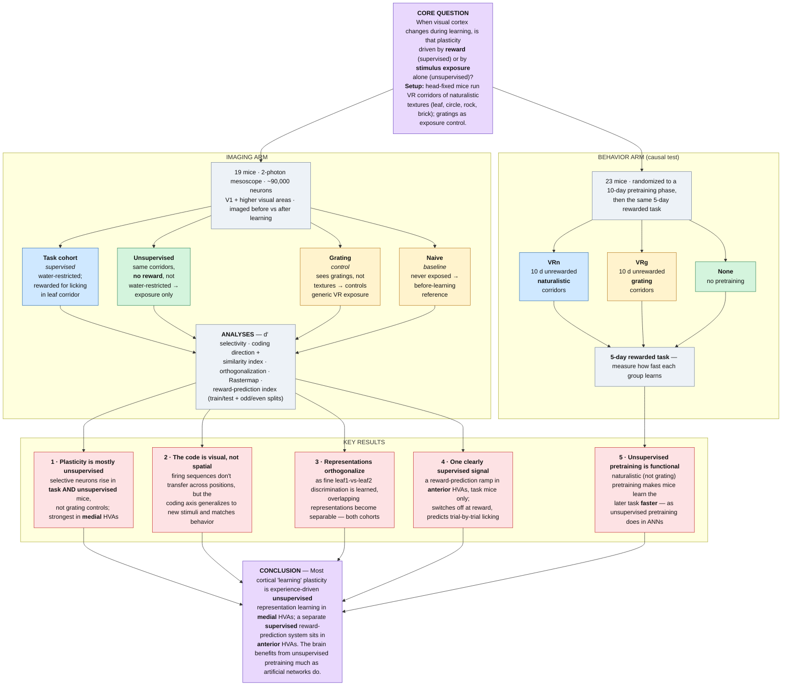

# Zhong et al. 2025 — Experiment Flowchart

*Unsupervised pretraining in biological neural networks (Nature 644:741–748)*

```mermaid
flowchart TB
    Q["`**CORE QUESTION**
    When visual cortex changes during learning, is that plasticity
    driven by **reward** (supervised) or by **stimulus exposure**
    alone (unsupervised)?
    **Setup:** head-fixed mice run VR corridors of naturalistic
    textures (leaf, circle, rock, brick); gratings as exposure control.`"]

    Q --> H1
    Q --> H2

    subgraph ARM1["IMAGING ARM"]
        direction TB
        H1["`19 mice · 2-photon mesoscope · ~90,000 neurons
        V1 + higher visual areas · imaged before vs after learning`"]
        H1 --> C1 & C2 & C3 & C4
        C1["`**Task cohort**
        _supervised_
        water-restricted;
        rewarded for licking
        in leaf corridor`"]
        C2["`**Unsupervised**
        same corridors,
        **no reward**, not
        water-restricted →
        exposure only`"]
        C3["`**Grating**
        _control_
        sees gratings, not
        textures → controls
        generic VR exposure`"]
        C4["`**Naive**
        _baseline_
        never exposed →
        before-learning
        reference`"]
        C1 --> AN
        C2 --> AN
        C3 --> AN
        C4 --> AN
        AN["`**ANALYSES** — d′ selectivity · coding direction +
        similarity index · orthogonalization · Rastermap ·
        reward-prediction index (train/test + odd/even splits)`"]
    end

    subgraph ARM2["BEHAVIOR ARM (causal test)"]
        direction TB
        H2["`23 mice · randomized to a 10-day pretraining phase,
        then the same 5-day rewarded task`"]
        H2 --> P1 & P2 & P3
        P1["`**VRn**
        10 d unrewarded
        **naturalistic**
        corridors`"]
        P2["`**VRg**
        10 d unrewarded
        **grating**
        corridors`"]
        P3["`**None**
        no pretraining`"]
        P1 --> TASK
        P2 --> TASK
        P3 --> TASK
        TASK["`**5-day rewarded task** — measure how fast each group learns`"]
    end

    AN --> R1 & R2 & R3 & R4
    TASK --> R5

    subgraph RES["KEY RESULTS"]
        direction TB
        R1["`**1 · Plasticity is mostly unsupervised**
        selective neurons rise in **task AND unsupervised** mice,
        not grating controls; strongest in **medial** HVAs`"]
        R2["`**2 · The code is visual, not spatial**
        firing sequences don't transfer across positions, but the
        coding axis generalizes to new stimuli and matches behavior`"]
        R3["`**3 · Representations orthogonalize**
        as fine leaf1-vs-leaf2 discrimination is learned,
        overlapping representations become separable — both cohorts`"]
        R4["`**4 · One clearly supervised signal**
        a reward-prediction ramp in **anterior** HVAs, task mice only;
        switches off at reward, predicts trial-by-trial licking`"]
        R5["`**5 · Unsupervised pretraining is functional**
        naturalistic (not grating) pretraining makes mice learn the
        later task **faster** — as unsupervised pretraining does in ANNs`"]
    end

    R1 --> CONC
    R2 --> CONC
    R3 --> CONC
    R4 --> CONC
    R5 --> CONC

    CONC["`**CONCLUSION** — Most cortical 'learning' plasticity is experience-driven **unsupervised**
    representation learning in **medial** HVAs; a separate **supervised** reward-prediction system sits in
    **anterior** HVAs. The brain benefits from unsupervised pretraining much as artificial networks do.`"]

    classDef q fill:#e9d8fd,stroke:#6b46c1,color:#111
    classDef head fill:#edf2f7,stroke:#718096,color:#111
    classDef task fill:#cfe8ff,stroke:#2b6cb0,color:#111
    classDef unsup fill:#d4f4dd,stroke:#2f855a,color:#111
    classDef ctrl fill:#fff3cd,stroke:#b7791f,color:#111
    classDef result fill:#fde2e4,stroke:#c53030,color:#111
    classDef conc fill:#e9d8fd,stroke:#6b46c1,color:#111
    class Q q
    class H1,H2,AN,TASK head
    class C1,P1 task
    class C2,P3 unsup
    class C3,C4,P2 ctrl
    class R1,R2,R3,R4,R5 result
    class CONC conc
```
