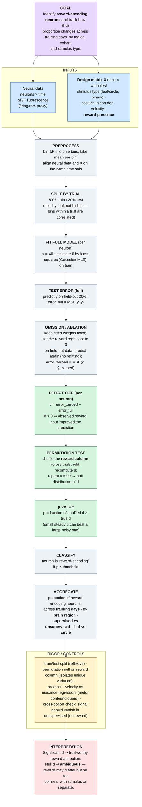

# Method Flowchart — Identifying Reward-Encoding Neurons

*Per-neuron encoding model with omission test + permutation validation (Zhong et al. 2025 data).*

```mermaid
flowchart TB
    Q["`**GOAL**
    Identify **reward-encoding neurons** and track how their
    proportion changes across training days, by region, cohort,
    and stimulus type.`"]

    Q --> D1 & D2

    subgraph INPUTS["INPUTS"]
        direction TB
        D1["`**Neural data**
        neurons × time
        ΔF/F fluorescence
        (firing-rate proxy)`"]
        D2["`**Design matrix X** (time × variables)
        stimulus type (leaf/circle, binary) ·
        position in corridor · velocity ·
        **reward presence**`"]
    end

    D1 --> PRE
    D2 --> PRE
    PRE["`**PREPROCESS**
    bin ΔF into time bins, take mean per bin;
    align neural data and X on the same time axis`"]

    PRE --> SPLIT
    SPLIT["`**SPLIT BY TRIAL**
    80% train / 20% test
    (split by trial, not by bin — bins within a trial are correlated)`"]

    SPLIT --> FIT
    FIT["`**FIT FULL MODEL** (per neuron)
    y = Xθ ; estimate θ by least squares (Gaussian MLE) on train`"]

    FIT --> EFULL
    EFULL["`**TEST ERROR (full)**
    predict ŷ on held-out 20%; error_full = MSE(y, ŷ)`"]

    EFULL --> ABL
    ABL["`**OMISSION / ABLATION**
    keep fitted weights fixed; set the reward regressor to 0
    on held-out data, predict again (no refitting);
    error_zeroed = MSE(y, ŷ_zeroed)`"]

    ABL --> DSTAT
    DSTAT["`**EFFECT SIZE (per neuron)**
    d = error_zeroed − error_full
    d > 0 ⇒ observed reward input improved the prediction`"]

    DSTAT --> PERM
    PERM["`**PERMUTATION TEST**
    shuffle the **reward column** across trials, refit, recompute d;
    repeat ×1000 → null distribution of d`"]

    PERM --> PVAL
    PVAL["`**p-VALUE**
    p = fraction of shuffled d ≥ true d
    (small steady d can beat a large noisy one)`"]

    PVAL --> CLASS
    CLASS["`**CLASSIFY**
    neuron is 'reward-encoding' if p < threshold`"]

    CLASS --> AGG
    AGG["`**AGGREGATE**
    proportion of reward-encoding neurons:
    across **training days** · by **brain region** ·
    **supervised vs unsupervised** · **leaf vs circle**`"]

    AGG --> CTRL

    subgraph CTRL_BOX["RIGOR / CONTROLS"]
        direction TB
        CTRL["`train/test split (reflexive) ·
        permutation null on reward column (isolates unique variance) ·
        position + velocity as nuisance regressors (motor confound guard) ·
        cross-cohort check: signal should vanish in unsupervised (no reward)`"]
    end

    CTRL --> CAV
    CAV["`**INTERPRETATION**
    Significant d ⇒ trustworthy reward attribution.
    Null d ⇒ **ambiguous** — reward may matter but be too
    collinear with stimulus to separate.`"]

    classDef goal fill:#e9d8fd,stroke:#6b46c1,color:#111
    classDef input fill:#cfe8ff,stroke:#2b6cb0,color:#111
    classDef step fill:#edf2f7,stroke:#718096,color:#111
    classDef stat fill:#d4f4dd,stroke:#2f855a,color:#111
    classDef ctrl fill:#fff3cd,stroke:#b7791f,color:#111
    classDef cav fill:#fde2e4,stroke:#c53030,color:#111
    class Q goal
    class D1,D2 input
    class PRE,SPLIT,FIT,EFULL,ABL,CLASS,AGG step
    class DSTAT,PERM,PVAL stat
    class CTRL ctrl
    class CAV cav
```
